# WebGame

## 1. 끝말잇기
> 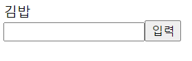
> 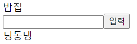
> 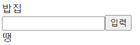  
> * 김밥 -> 밥집: 딩동댕  
> * 밥집 -> 공부: 땡
 

## 2. 구구단
> 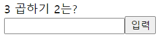
> 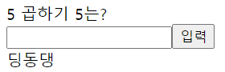
> 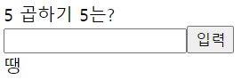  
> * 3 곱하기 2 -> 6: 딩동댕
> * 5 곱하기 5 -> 10: 땡
 

## 3. 숫자야구
> 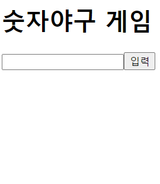
> 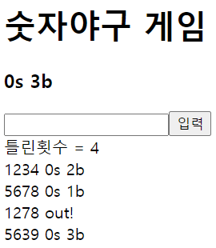
> 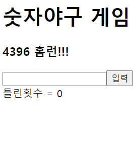
> 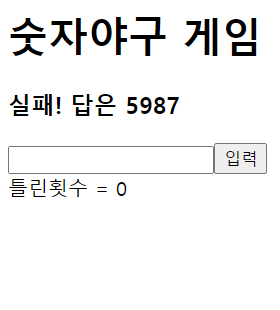  
> * 1부터 9로 이루어진 4개의 숫자를 맞추는 게임  
> * 기회는 총 6번  
> * s(strike): 입력한 4개의 숫자 중 정답과 일치하는 숫자가 있는데 자리까지 일치한 경우  
> * b(ball): 입력한 4개의 숫자 중 정답과 일치하는 숫자가 있는데 자리가 불일치한 경우  
> * out: 입력한 4개의 숫자 중 정답과 일치하는 숫자가 없을 경우  
 

## 4. 틱택토
> 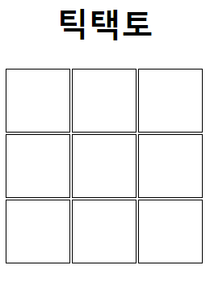
> 
> 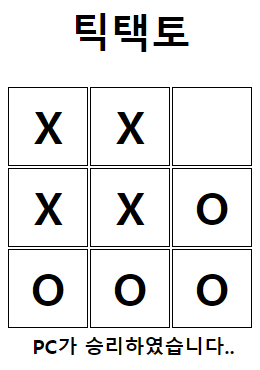  
> * 오목의 축소판  
> * 한 줄을 먼저 만드는 쪽이 승리  
> * 상대는 컴퓨터(O)이고 플레이어(X)가 먼저 시작  
 

## 5. 로또추첨
> 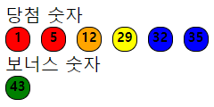  
> * 1 ~  10: 빨간색 공  
> * 11 ~  20: 오렌지색 공  
> * 21 ~  30: 노란색 공  
> * 31 ~  40: 파란색 공  
> * 41 ~  45: 초록색 공  
 

## 6. 가위바위보
> 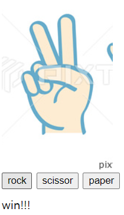
> 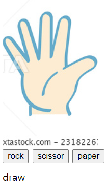
> 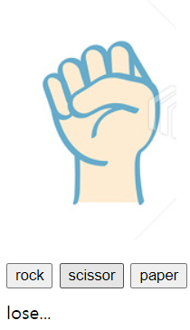  
> * 버튼 선택으로 가위바위보 진행  
> * scissor -> rock: win  
> * paper -> paper: draw  
> * rock -> scissor: lose  
 

## 7. 지뢰찾기
> 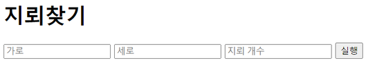  
> 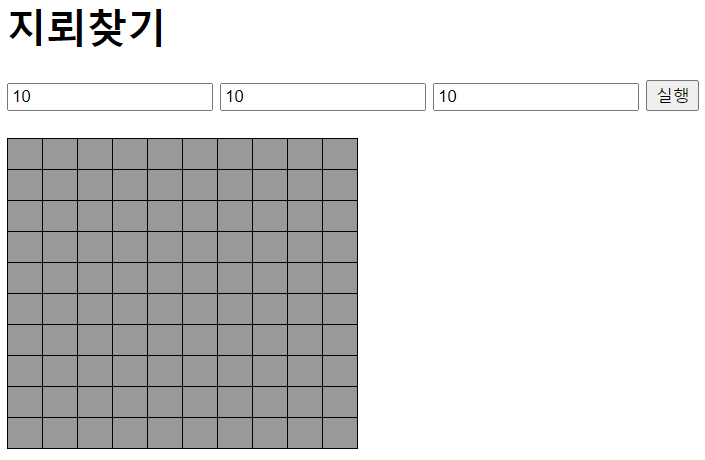  
> 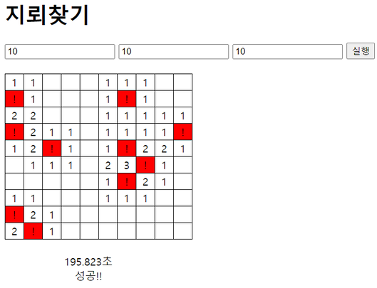  
> 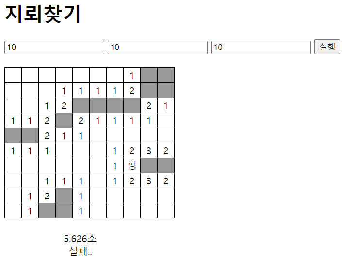  
> * 가로, 세로, 지뢰의 수 입력 후 실행 버튼을 클릭하면 게임 시작  
> * 클릭: 클릭한 곳의 정보 열람  
> ※ 숫자: 숫자 기준으로 주변(8개의 칸)에 있는 지뢰 개수 표시  
> ※ 펑: 지뢰  
> * 오른쪽 클릭: 지뢰로 추정되는 곳 표시  
> * 오른쪽 두번 클릭: 불확실한 정보(?) 표시  
 

## 8. 반응속도체크
> 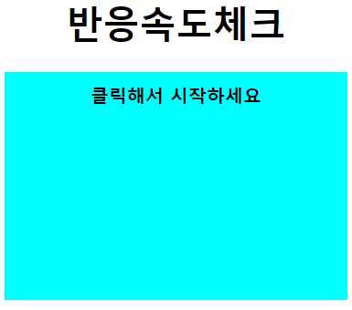
> 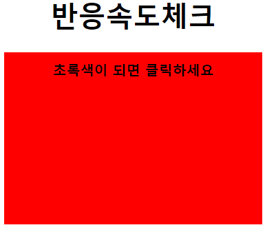
> 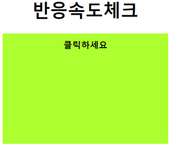
> 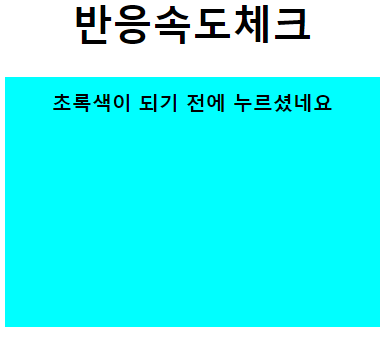
> 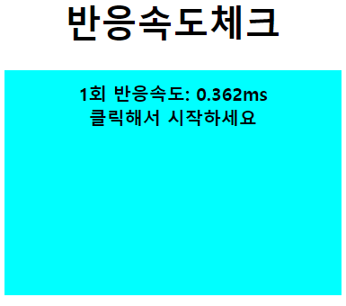
>   
> * 하늘색 화면 -> 빨간색 화면 -> 초록색 화면 -> 하늘색 화면순으로 게임 진행  
> * 빨간색 화면에서 초록색 화면으로 바뀌기 전에 클릭하면 부정시작으로 간주
> * 총 5번 진행하면 5회 평균 기록이 표시  
 

## 9. 카드짝맞추기
> 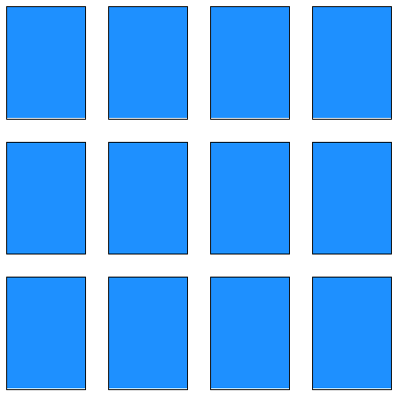
> 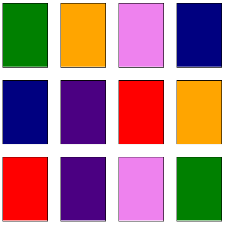

> 
> 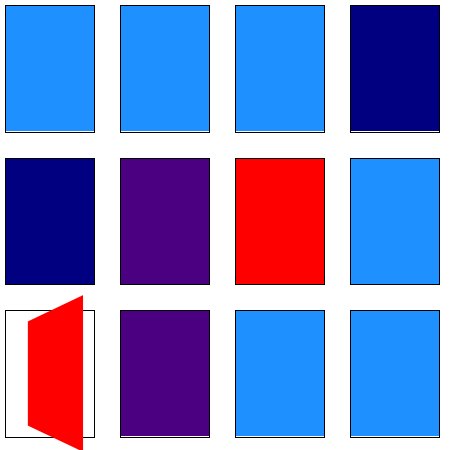
> 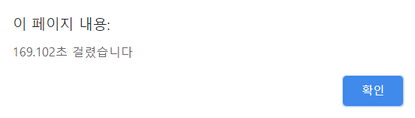  
> * 처음에 카드가 뒤집어지면서 카드색깔 공개  
> * 이후 다시 뒤집어져서 하늘색 카드로 셋팅  
> * 카드짝을 다 맞추면 클리어 시간 공개  
 

## 10. JS스톤
> 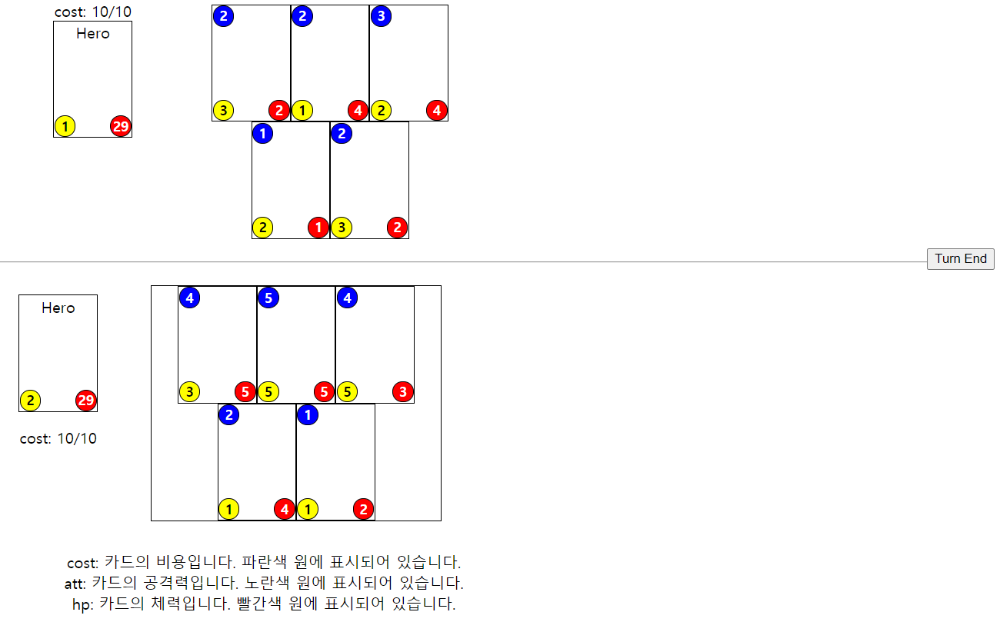
  
> 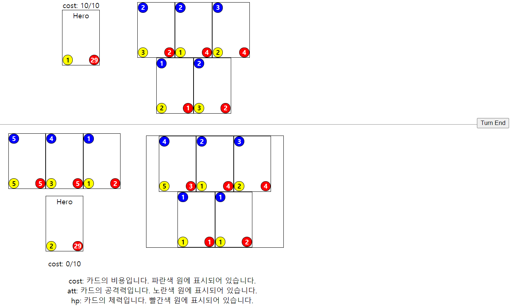
  
> 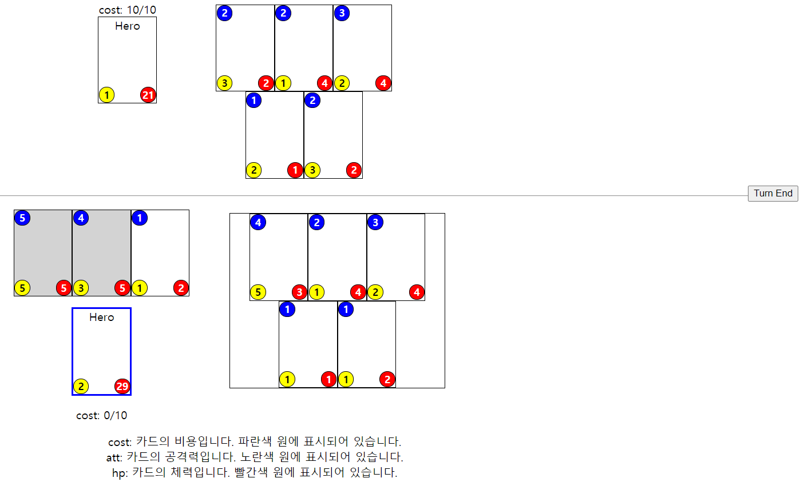
  
> 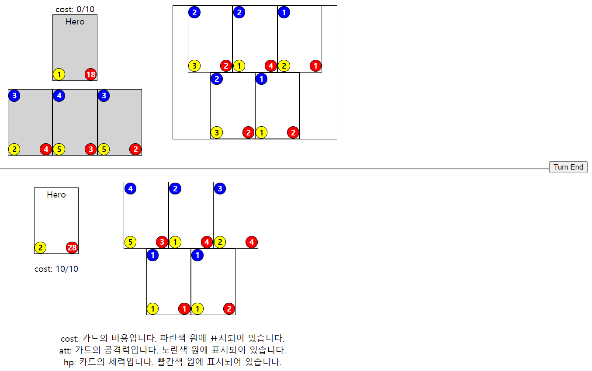
  
> 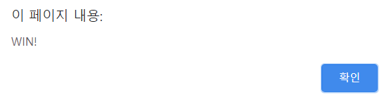
> 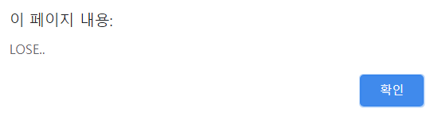  
> * 상대편 Hero카드의 hp를 0이하로 만들면 승리하는 게임  
> * Hero카드의 오른쪽에 있는 5개의 카드는 덱이고 여기서 카드를 뽑으면 카드가 필드로 이동  
> * 덱에서 카드를 뽑을때마다 cost가 소모되고 덱에 새로운 카드가 공급  
> * 필드에 있는 카드로 상대편 필드에 있는 카드를 공격 가능  
> * 공격한 카드는 비활성화되면서 공격이 불가능
> * 'Turn End' 버튼을 클릭하면 턴이 종료되며 cost가 10으로 충전되고 턴 변경  
> * 게임에서 이기면 'WIN!', 지면 'LOSE'라는 결과를 표시  
 

## 11. 2048
> 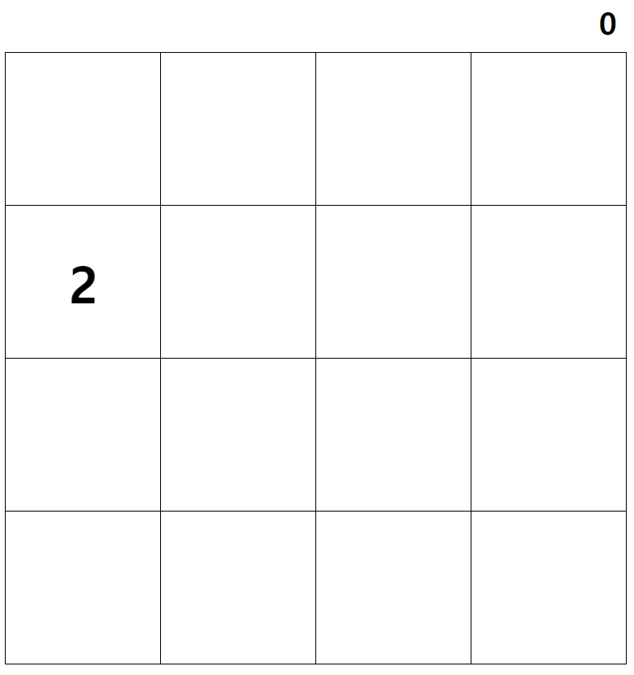
  
> 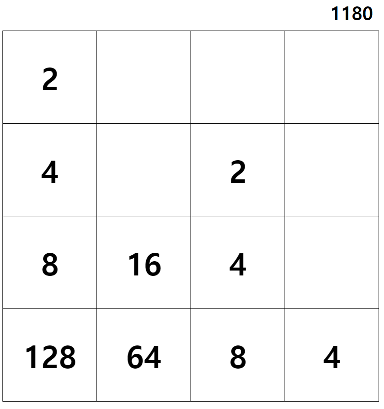
  
> 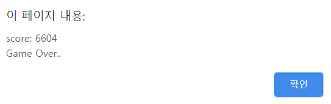  
> * 2의 배수의 숫자들 중 같은 숫자들을 합쳐서 점점 큰 숫자를 만들어가는 게임  
> * 화살표 왼쪽, 오른쪽, 위쪽, 아래쪽 방향키 중 하나를 누르면 숫자들이 누른 방향으로 이동  
> * 이동방향으로 같은 숫자들이 붙어있으면 숫자들이 합쳐지고 합쳐진 숫자가 표시  
> * 숫자가 모든 칸에 다 차면 게임이 끝나면서 점수 표시  
