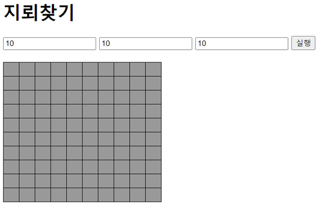
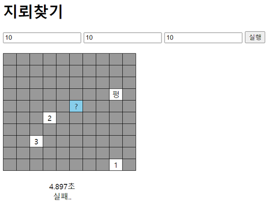
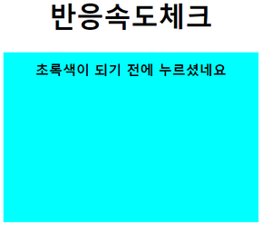
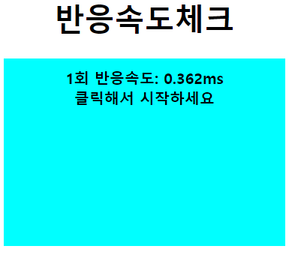
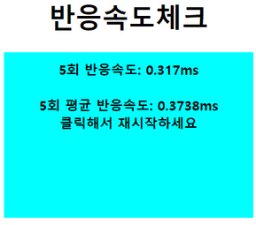
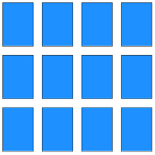
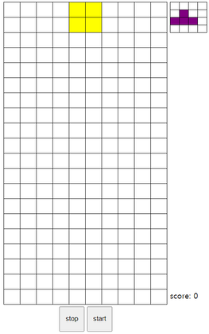
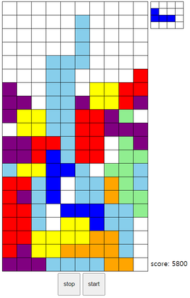
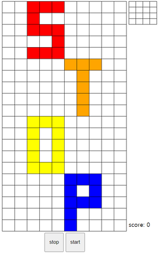
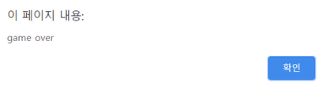

# WebGame

- ## 끝말잇기
  - ### 처음화면
    
  
  - ### 정답
      
    - 김밥 -> 밥집: 딩동댕
  
  - ### 오답
      
    - 밥집 -> 공부: 땡  
 

- ## 구구단
  - ### 처음화면
    
    
  - ### 정답
      
    - 3 곱하기 2 -> 6: 딩동댕
    
  - ### 오답
      
    - 5 곱하기 5 -> 10: 땡  
 

- ## 숫자야구
    - ### 처음화면
        
      - 1부터 9로 이루어진 4개의 숫자를 맞추는 게임  
      - 기회는 총 6번
      
    - ### 진행중
        
      - s(strike): 입력한 4개의 숫자 중 정답과 일치하는 숫자가 있는데 자리까지 일치한 경우  
      - b(ball): 입력한 4개의 숫자 중 정답과 일치하는 숫자가 있는데 자리가 불일치한 경우  
      - out: 입력한 4개의 숫자 중 정답과 일치하는 숫자가 없을 경우
      
    - ### 성공
      
      
    - ### 실패
        
 

- ## 틱택토
  - ### 처음화면
      
    - 오목의 축소판  
    - 한 줄을 먼저 만드는 쪽이 승리  
    - 상대는 컴퓨터(O)이고 플레이어(X)가 먼저 시작
    
  - ### 승리
    
    
  - ### 패배
      
 

  - ## 로또추첨
    - ### 시작
        
      - 1 ~  10: 빨간색 공  
      - 11 ~  20: 오렌지색 공  
      - 21 ~  30: 노란색 공  
      - 31 ~  40: 파란색 공  
      - 41 ~  45: 초록색 공  
 

- ## 가위바위보
  - ### 승리
      
    - scissor -> rock: win

  - ### 비김
      
    - paper -> paper: draw

  - ### 패배
      
    - rock -> scissor: lose  

  ※ 버튼 선택으로 가위바위보 진행  
 

- ## 지뢰찾기
  - ### 7처음화면
      
    - 가로, 세로, 지뢰 개수 입력 후 실행 버튼을 클릭하면 게임 시작

  - ### 시작
      
    - 클릭: 클릭한 곳의 정보 열람  
    - 오른쪽 클릭: !(지뢰로 추정되는 곳) 표시  
    - 오른쪽 두번 클릭: ?(불확실한 곳) 표시

  - ### 성공
    

  - ### 실패
      

  ※ 숫자: 숫자 기준으로 주변(8개의 칸)에 있는 지뢰 개수 표시  
  ※ 펑: 지뢰  
 

- ## 반응속도체크
  - ### 처음화면
    

  - ### 준비
    

  - ### 시작
    

  - ### 부정시작
      
    - 빨간색 화면에서 초록색 화면으로 바뀌기 전에 클릭하면 부정시작으로 간주

  - ### 결과
    

  - ### 평균결과
      
    - 총 5번 진행하면 5회 평균 기록이 표시  
 

- ## 카드짝맞추기
  - ### 처음화면
    

  - ### 시작
      
    - 처음에 카드가 뒤집어지면서 카드색깔 공개  
    - 이후 다시 뒤집어져서 하늘색 카드로 셋팅

  - ### 진행중
    

  - ### 성공시간
    
    - 카드짝을 다 맞추면 클리어 시간 공개  
 

- ## JS스톤
  - ### 처음화면
      
    - 상대편 Hero카드의 hp를 0이하로 만들면 승리하는 게임

  - ### 카드뽑기
      
    - Hero카드의 오른쪽에 있는 5개의 카드는 덱이고 여기서 카드를 뽑으면 카드가 필드로 이동  
    - 덱에서 카드를 뽑을때마다 cost가 소모되고 덱에 새로운 카드가 공급  

  - ### 공격
      
    - 필드에 있는 카드로 상대편 필드에 있는 카드를 공격 가능  
    - 공격한 카드는 비활성화되면서 공격이 불가능

  - ### 상대차례
      
    - 'Turn End' 버튼을 클릭하면 턴이 종료되며 cost가 10으로 충전되고 턴 변경

  - ### 승리
      
    - 게임에서 이기면 'WIN!'이라는 결과 표시

  - ### 패배
      
    - 게임에서 지면 'LOSE..'이라는 결과 표시  
 

- ## 2048
  - ### 처음화면
      
    - 2의 배수의 숫자들 중 같은 숫자들을 합쳐서 점점 큰 숫자를 만들어가는 게임

  - ### 진행
      
    - 화살표 왼쪽, 오른쪽, 위쪽, 아래쪽 방향키 중 하나를 누르면 숫자들이 누른 방향으로 이동  
    - 이동방향으로 같은 숫자들이 붙어있으면 숫자들이 합쳐지고 합쳐진 숫자가 표시

  - ### 결과
      
    - 숫자가 모든 칸에 다 차면 게임이 끝나면서 점수 표시  
   

- ## 테트리스
  - ### 처음화면
      
    - 블록을 쌓고 없애면서 점수를 얻는 게임  
    - 우측 상단에 다음에 나올 블록을 미리 표시  
    - 우측 하단에 현재 점수 표시

  - ### 진행중
      
    - 화살표 왼쪽, 오른쪽, 아래쪽 방향키 중 하나를 누르면 블록이 누른 방향으로 이동  
    - 화살표 위쪽 방향키를 눌렀다 때면 블록이 시계방향으로 90도 회전  
    - z키를 눌렀다 때면 블록이 반시계방향으로 90도 회전  
    - space bar를 눌렀다 때면 블록이 즉시 맨 밑으로 이동

  - ### 중지
      
    - 'stop'버튼을 누르면 게임이 멈추며 중지 상태 화면이 표시  
    - 중지된 상태에서 'start'버튼을 누르면 게임 재개

  - ### 종료
      
    - 블록이 더 이상 생성될 수 없으면 게임 종료  

  

- ## 참고
  - YouTube: https://www.youtube.com/watch?v=Qq2IJ2iEgWA&list=PLcqDmjxt30Rtbxbh4eJREOVekql_kWVmu
